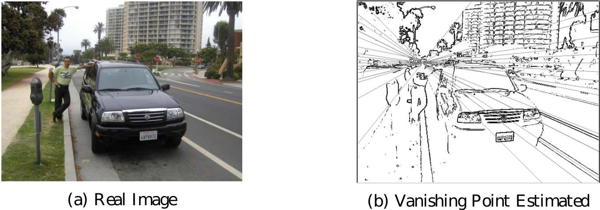
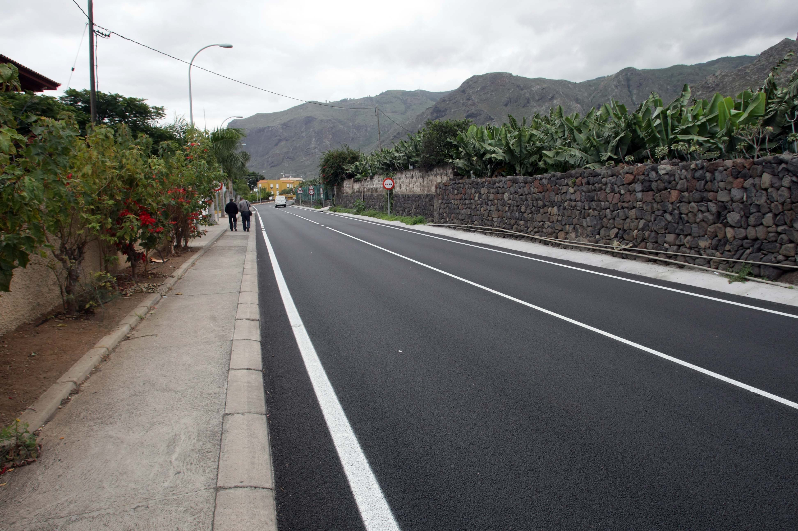
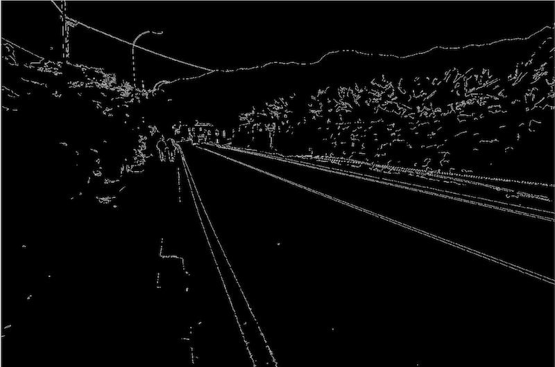
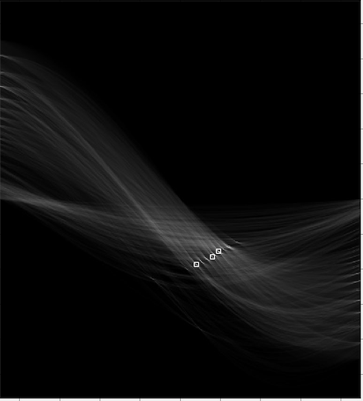

# 2D-to-3DAnaglyph-ImageConversion
Convert 2D images to 3D anaglyph image using vanishing point approach

## Overview

Our study tries to estimate a depth map from a mono image.  It is a difficult task and there are different ways to approach it.
My approach uses outdoor images. The vanishing point is the place where two or more parallel lines (real or imaginary) converge towards infinity in an image.  For example, the lines that generate the edges of a road and its projection towards infinity. The place where these lines intersect in a literal or imaginary way, is what we know as the vanishing point.

  

### Data

This aproach needs outdoor images containing vanishing point.

  

### Model

First convert image to grayscale and apply canny transform.

  

Then apply Hough transform to obtain the main lines in the image.

  

