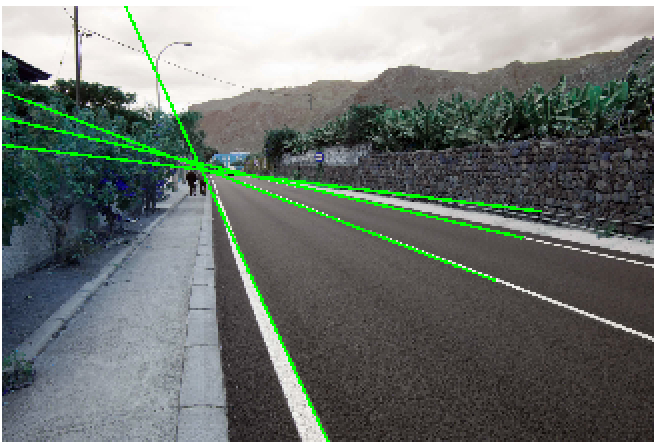
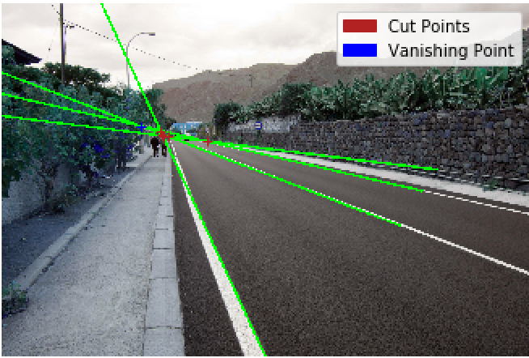
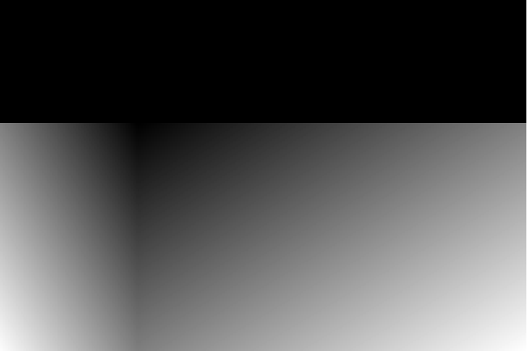
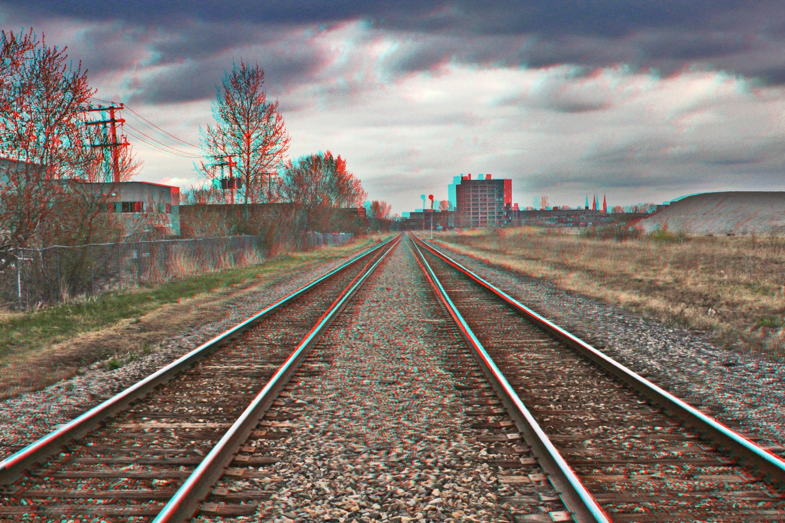
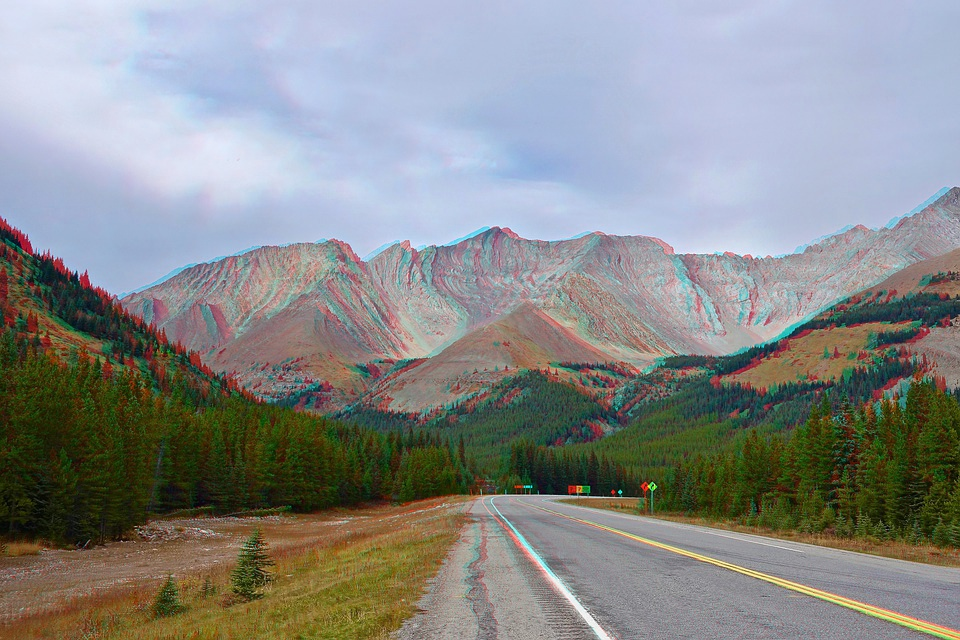
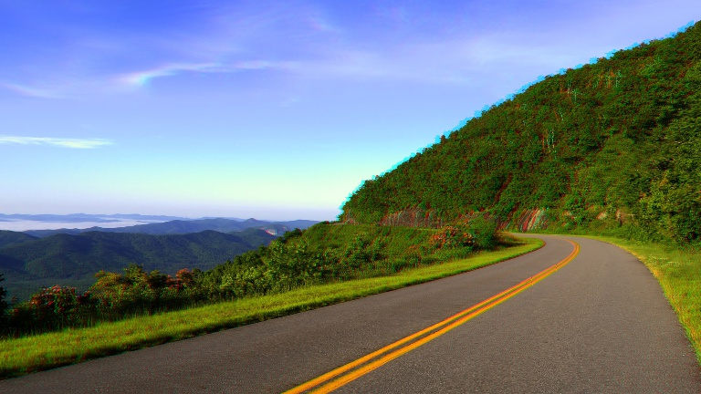

# Anaglyph estimation from mono images
Anaglypher Python script for making anaglyph-3D maps from mono images.

## Overview

Our study tries to estimate a depth map from a mono image.  It is a difficult task and there are different ways to approach it.
My approach uses outdoor images. The vanishing point is the place where two or more parallel lines (real or imaginary) converge towards infinity in an image.  For example, the lines that generate the edges of a road and its projection towards infinity. The place where these lines intersect in a literal or imaginary way, is what we know as the vanishing point.

<p align="center">
  
</p>

### Data

This aproach needs outdoor images containing vanishing point.
<p align="center">
  
</p>

### Model

First convert image to grayscale and apply canny transform.
<p align="center">
  
</p>

Then apply Hough transform to obtain the main lines in the image.

<p align="center">
  
</p>

Transforming the parametric space 	(θ,ρ) to (x,y) and plot the lines.

<p align="center">
  
</p>

Then we get the cut points between lines and select vanishing point as the cut point that have most cut points closer.

<p align="center">
  
</p>

With the vanishing point coordinates, we build a Depth Map.

<p align="center">
  
</p>

Finally, we construct with the depth map the parallax matrix and apply channel offset.

<p align="center">
  
</p>

## Example.py

```python
import cv2
import anagliph
import string
from random import choices

# read 2D-Image input
shape = cv2.imread('images/carretera.jpg')

# Scale input image for less time computation
Image3D = anagliph.ConvertImageto3D(shape, xscale=0.3, yscale=0.3)

# Random output image name
name = ''.join(choices(string.ascii_uppercase + string.digits, k=5))

# Save 3D-Anaglyph Image
cv2.imwrite('results/{0}.jpg'.format(name),Image3D)
```






## License
(c) 2013 Pedro Rodenas. MIT License

